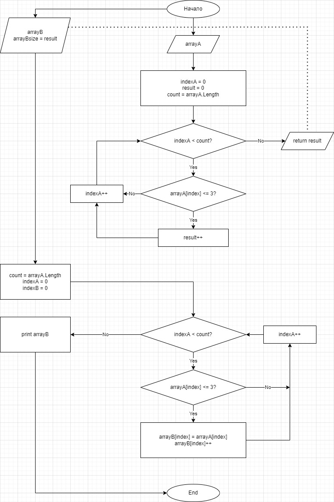

***Итоговая работа***
1. Создать репозиторий на GitHub
2. Нарисовать блок-схему алгоритма (можно обойтись блок-схемой основной содержательной части, если вы выделяете её в отдельный метод)
3. Снабдить репозиторий оформленным текстовым описанием решения (файл README.md)
4. Написать программу, решающую поставленную задачу
5. Использовать контроль версий в работе над этим небольшим проектом (не должно быть так, что всё залито одним коммитом, как минимум этапы 2, 3, и 4 должны быть расположены в разных коммитах)

Задача: Написать программу, которая из имеющегося массива строк формирует новый массив из строк, длина которых меньше, либо равна 3 символам. Первоначальный массив можно ввести с клавиатуры, либо задать на старте выполнения алгоритма. При решении не рекомендуется пользоваться коллекциями, лучше обойтись исключительно массивами.

**Блок-схема и описание**

Для выполнения задачи было использовано 3 метода-цикла.

1. int Method был использован для подсчета количества искомых элементов в исходном массиве. Результат используется для определения размера итогового массива и его объявления.
Если элементов удовлетворяющих условию нет, то консоль выводит соответствующее сообщение:

`Console.WriteLine("Нет искомых элементов ");`

2. void FillArray был использован для заполнения массива размера result/res из int Method. Заполняется массив теми же искомыми элементами.

3. void PrintArray выводит итоговый массив на экран.

